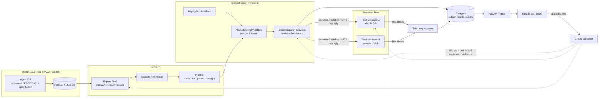

# GridTwin: Spec

> A fault-tolerant VPP dispatch orchestrator. It drives a simulated fleet of Base Power home batteries using replayed, real post-RTC+B ERCOT market data, and it keeps its promises while you break it on camera.

| | |
|---|---|
| **Event** | Base Power x AITX Hackathon, Fri Sep 25 to Sun Sep 27, 2026. Submission due **Sun 11:00 AM CT** |
| **Tracks** | Track 2 (Orchestration), primary. Track 1 (Open Grid Data), secondary |
| **Owner** | Sree |
| **Tracker** | GitHub Issues. This spec is the `spec` issue; tickets are labeled `ticket` |
| **Status** | Ready for tickets |
| **Glossary** | `CONTEXT.md`. Use its nouns everywhere: code, commits, UI, video |

---

## Problem Statement

Base operates thousands of home batteries as one fleet and earns (or loses) money in ERCOT's real-time market. Since RTC+B went live on **Dec 5, 2025**, ancillary-service premiums have compressed. Most of a battery's value now arrives in a small number of scarcity intervals. That changes what "reliable" means. A dispatcher that is 99% available but drops out during the one evening ramp that sets the month's revenue has failed exactly where it counts. Every dispatch decision also competes with a promise to members: keep enough charge to back up their home.

From the seat of a market-ops or platform engineer at Base, the problem looks like this:

> When the trading logic decides to discharge the fleet at 6:50 PM, that instruction has to land on thousands of devices **exactly once and on time**, without draining anyone below their **backup reserve**. It has to do that even when a worker crashes, a slice of devices goes dark, telemetry goes stale, or the market-data feed breaks. I also need to know **which intervals are worth that reliability**, in real ERCOT dollars.

Typical demos show either a price chart or a toy agent swarm. Neither one shows whether a system keeps its promises under failure, or what each failure costs.

## Solution

GridTwin replays real ERCOT settlement-point prices (Dec 5, 2025 to the latest cached day) through a production-shaped pipeline:

**market-data feed → scarcity-risk model → fleet planner → durable orchestration (Temporal) → sharded dispatch (NATS) → simulated Base Core batteries → telemetry → command ledger → interval results → live dashboard**

A **chaos panel**, plus scripted chaos scenarios, can kill workers, partition devices, delay telemetry, duplicate commands and break or poison the price feed while a replay runs. The dashboard shows these live:

- target vs delivered MW
- reserve violations (must stay 0)
- duplicate effects (must stay 0)
- degradation level
- recovery time
- an SLO table

An **Insights** tab shows what most people miss in post-RTC+B data: how concentrated fleet value is in a few intervals, and how many dollars a minute of dispatch downtime costs by hour of day.

`make up && make demo` runs everything locally. The market data is real. The orchestration, ledger and planner are production patterns. The devices are simulated, and the project says so openly.

---

## User Stories

Actors: **Operator** (Base market-ops or platform engineer), **Analyst** (Base markets/quant), **Judge** (Base engineer evaluating the repo), **Member** (Base customer).

1. As an Operator, I want to replay any cached post-RTC+B ERCOT day at a chosen speed, so that I can watch dispatch handle real market conditions.
2. As an Operator, I want each 15-minute market interval to produce one fleet MW target, so that the fleet acts on a single auditable decision per interval.
3. As an Operator, I want the fleet target split into per-device setpoints based on each device's state of charge and health, so that no device is asked for more than it can deliver.
4. As a Member, I want my battery never commanded below the reserve floor, so that my home stays protected in an outage.
5. As an Operator, I want every command to carry an idempotency key and an expiry, so that retries and duplicate deliveries never make a device act twice or act late.
6. As an Operator, I want a command ledger recording issue, ack, expiry and failure for every command, so that I can audit what the fleet was told and what it did.
7. As an Operator, I want orchestration to survive a worker being killed mid-interval, so that one crash never costs an interval.
8. As an Operator, I want devices with stale telemetry excluded from planning and flagged, so that plans never count on capacity that may not exist.
9. As an Operator, I want shortfall from unresponsive devices reallocated to healthy devices within the same interval, so that the fleet still hits its target.
10. As an Operator, I want the system to step down a degradation ladder when the market feed fails or returns bad data, so that it never acts on garbage.
11. As an Operator, I want a chaos panel and scripted chaos scenarios, so that I can demonstrate and regression-test resilience on demand.
12. As an Operator, I want a live dashboard covering price, target, delivered MW, fleet SoC, degradation level, events and SLOs, so that I can see system health at a glance.
13. As an Analyst, I want a rolling-horizon planner that respects reserve, efficiency and degradation cost, so that dispatch captures more value than a fixed schedule.
14. As an Analyst, I want a backtest comparing the naive schedule, the LP and perfect foresight over the post-RTC+B window, so that I can quantify the planner's edge.
15. As an Analyst, I want a calibrated probability of a price spike in the next 1–4 hours, so that the fleet holds energy for the intervals that matter.
16. As an Analyst, I want to see how concentrated fleet value is in a few intervals and days, so that I understand why reliability during spikes dominates.
17. As an Analyst, I want expected dollars lost per minute of dispatch downtime by hour of day and month, so that I can prioritize reliability work and on-call.
18. As a Judge, I want to run the whole system with one command and a scripted scenario, so that I can verify it works without the team present.
19. As a Judge, I want benchmarks for throughput, p99 dispatch latency, recovery time and scaling from 1k to 20k devices, so that I can assess performance claims.
20. As a Judge, I want the README to state plainly what is real and what is simulated, so that I can trust the claims.
21. *(Stretch)* As a Member, I want my reserve raised automatically before storms or grid-tight evenings, with a plain-English reason, so that I trust Base with my backup.

---

## Implementation Decisions

### Architecture

### Stack

| Concern | Choice | Why |
|---|---|---|
| Language | Python 3.12, `uv`, `ruff`, `pytest`, `pydantic` v2 | Fastest path for a solo builder; typed models |
| Orchestration | **Temporal** (Python SDK), dev server in Docker (pin the image tag) | Base lists Temporal in its own stack; durable execution, retries, visibility UI |
| Device transport | **NATS** core (request/reply + pub/sub) | Lightweight single container; makes partitions and delays easy to inject |
| State | **Postgres 16** (psycopg 3) | Ledger, interval results, chaos events, telemetry snapshot |
| Market data | **DuckDB + Parquet** cache; `gridstatus` OSS library; ERCOT Public API as fallback; Open-Meteo weather | No live API calls during the demo |
| Optimizer | `scipy.optimize.linprog` (HiGHS) | No external solver install |
| Risk model | LightGBM + scikit-learn | Fast, calibratable, explainable |
| API | FastAPI + Server-Sent Events; OpenAPI schema → generated TypeScript types | Typed contract between Python and the web app |
| Dashboard | **Next.js (App Router) + React + TypeScript**, Tailwind CSS, Recharts; own container | Polished, fast-to-iterate UI for the demo video |
| Runtime | Docker Compose + Makefile | `make up`, `make demo`, `make chaos`, `make bench` are the public interface |

### Modules

Keep modules deep and interfaces small. Interfaces below are described by shape, not signature.

| Module | Owns | Interface shape |
|---|---|---|
| `marketdata` | Ingest, cache, audit, demo-day finder | load a window of prices/forecasts for settlement points; rank demo days |
| `replay` | Replay clock, replay feed | clock gives replay time; feed gives a validated **Market Snapshot** for an interval or raises **Feed Error** |
| `risk` | Features, training, inference | given interval + snapshot → **Risk Curve** (spike probability per upcoming interval) |
| `planner` | Strategies as **pure functions** | given **Fleet State** + snapshot + risk + config → **Fleet Plan** |
| `dispatch` | Temporal workflows and activities; disaggregation; reallocation; degradation ladder | given a plan → **Interval Result** |
| `fleet` | Device model (pure) + shard simulator (IO) | device applies a **Command** at a replay time → **Ack**; device ticks forward by dt |
| `transport` | NATS and in-memory implementations of the same interface | send command batch to shard → acks; publish/subscribe telemetry |
| `ledger` | Postgres schema + repository | idempotent upsert by **Idempotency Key**; results; events |
| `telemetry` | Heartbeat ingestion, staleness | latest state per device, stale set |
| `chaos` | Controller API + scenario runner | apply/clear a **Chaos Scenario**; run a scripted scenario |
| `insights` | Offline analyses | produce tables/figures from cache |
| `api` | FastAPI: REST + SSE + OpenAPI schema | read-only views, chaos controls, event stream |
| `web` | Next.js dashboard (TypeScript) | Live, Data and Insights pages built on generated API types |

### Domain invariants (non-negotiable)

- **Sign convention:** +MW = discharge, −MW = charge.
- **Market Interval** = 15-minute ERCOT real-time settlement interval. Store all timestamps in UTC; display in Central time. ERCOT's DST flags are handled at ingest. Mar 8, 2026 has 92 intervals.
- **Reserve Floor** defaults to 20% SoC per device, matching Base's stated minimum-SoC target. The planner, the disaggregator and the device model all enforce it (defense in depth).
- **Idempotency Key** = `run_id : interval_start : device_id : seq`. `seq` increments only on reallocation. Every command expires at the end of its interval. Devices ignore expired or superseded commands and apply a key at most once.
- **Interval workflow id** = `interval:{run_id}:{interval_start}`, so Temporal rejects a second start of the same interval (idempotent scheduling).
- Workflows are **deterministic**: all IO lives in activities, and workflows use Temporal time only. `ReplayRunWorkflow` uses **continue-as-new** every 48 intervals.
- **At least two worker replicas** poll the same task queue.
- **Achievable Target** = min(plan target, available power of non-stale devices). SLOs are measured against the achievable target.
- **Degradation Ladder:**
  - L0 Optimized
  - L1 Cached Plan: last good plan, still inside its horizon
  - L2 Safe Rule: discharge only if the last valid price is at or above a threshold, never below floor
  - L3 Hold: 0 MW

  Every transition is logged as an event. The ladder recovers upward automatically after N clean intervals.
- **Clock** is an interface:
  - Compose mode uses a wall-anchored replay clock. Replay time = replay start + (wall now − wall start) × speed, broadcast once per run.
  - In-process test mode uses a manual clock advanced by the Scenario Runner.

### Per-interval flow (`MarketIntervalWorkflow`)

1. **Snapshot** (activity). Read the market snapshot through the feed validator and circuit breaker, then decide the degradation level.
2. **Fleet state** (activity). Aggregate available charge/discharge power and energy above floor from non-stale telemetry.
3. **Plan** (activity wrapping the pure planner). Produce a Fleet Plan for the horizon, and take this interval's target.
4. **Disaggregate.** Compute per-device setpoints proportional to headroom, respecting floor and power limits, grouped into per-shard batches.
5. **Dispatch** (one activity per shard, concurrent). Upsert commands into the ledger, send the batch over transport with a timeout, collect acks, and heartbeat to Temporal.
6. **Reallocate.** If the shortfall exceeds tolerance and the interval deadline allows, issue `seq+1` commands to devices with headroom. Rounds are bounded.
7. **Record.** Write the Interval Result (target, achievable, delivered, level, counts, latency) and emit an SSE event.

### Defaults (all overridable via env)

| Setting | Default | Note |
|---|---|---|
| Devices | 2,000 (bench up to 20,000) | |
| Device energy | 39.2 kWh | Base Core published capacity |
| Device max power | 10 kW | **Placeholder. Confirm at office hours or the factory tour** |
| Round-trip efficiency | 90% | Assumption, documented |
| Reserve floor | 20% SoC | |
| Shards / simulators | 20 shards across 2 simulator processes | |
| Telemetry period | 1 replay-minute | |
| Stale threshold | 3 missed heartbeats | |
| Replay speed | 60x (one interval every 15 s wall) | |
| Planner horizon | 96 intervals (24 h) | |
| Settlement point | `LZ_HOUSTON`; `HB_NORTH`, `LZ_NORTH`, `LZ_SOUTH`, `HB_HOUSTON`, `HB_SOUTH` also cached | |
| Tolerance | ±5% of achievable target | |

### Data decisions

- **Window:** Dec 5, 2025 (RTC+B go-live) to the latest available day, flagged `regime=post_rtcb`. Pre-RTC+B history back to Dec 2023 is optional, flagged `regime=pre_rtcb`, and used for regime comparison in Insights only. Never train across regimes without the flag.
- **Datasets (ERCOT report IDs):**
  - RT SPP `NP6-905-CD`
  - DAM SPP `NP4-190-CD`
  - DAM AS clearing `NP4-188-CD`; RT AS clearing `NP6-331-CD` (context only; may be missing from the API)
  - 7-day load forecast by weather zone `NP3-565-CD`, plus actual load
  - Wind actual/forecast `NP4-732-CD` / `NP4-742-CD`
  - Solar actual/forecast `NP4-745-CD` / `NP4-737-CD`
  - Hourly resource outage capacity `NP3-233-CD`
  - Open-Meteo hourly temperature for Houston, DFW, Austin and San Antonio
- **Ingest** is resumable and idempotent: one file per dataset per day, with a `data-audit` report. It respects the ERCOT API limit (30 req/min) and the gridstatus.io row budget. The ERCOT API blocks non-US IPs.
- **The demo never calls external APIs.** Replay reads only the local cache.
- **A small real-day fixture** (a few hundred KB) is checked in for tests and CI.
- **Forecast vintages:** if only latest-vintage forecasts are cached, the risk backtest carries a documented leakage caveat in DATA.md.

### Chaos catalogue

| Scenario | Mechanism | Expected behaviour | Evidence |
|---|---|---|---|
| Kill worker | Docker API kills a worker container mid-interval; restarts after a delay | Activities retry on the surviving worker; no interval skipped | Recovery time; Temporal history shows the retry |
| Device partition | Simulator drops commands and telemetry for X% of devices | Devices go stale; shortfall is reallocated | within-tolerance % vs achievable |
| Telemetry delay | Simulator delays heartbeats by Y s | Staleness detected; no over-commit | 0 reserve violations |
| Duplicate commands | Simulator delivers batches twice and replays old ones | Devices dedupe by key | duplicate effects = 0 |
| Feed outage | Replay feed raises | Ladder steps down, then recovers | Degradation timeline |
| Feed outlier | Inject a $9,999 price | Validator rejects; no action on it | Rejected-snapshot event |
| Scale burst | Devices x10 | Batching and backpressure hold | p99 latency |

The chaos controller mounts the Docker socket. That is for local demos only, and the README says so.

---

## Testing Decisions

A good test asserts observable behaviour through an agreed seam, never internals. It is deterministic (seeded RNG, fixture data, manual clock) and fast enough to run on every push. Two seams are agreed. Any new seam needs an entry in `docs/DECISIONS.md`.

**Seam A: Scenario (system level; the one that matters).** Run a replay window, with an optional chaos script, and get a **Scenario Report**:
`intervals, within_tolerance_pct, reserve_violations, duplicate_deliveries, duplicate_effects, max_recovery_s, degradation_events, value_usd, p99_dispatch_ms`.
Tests assert SLOs on the report. Two modes:
- **in-process:** Temporal's time-skipping test environment, the in-memory transport and the manual clock. Runs in CI.
- **compose:** the full stack, run by `make test-e2e`, marked `e2e`. Required for worker-kill and container-level chaos.

**Seam B: Pure domain.** Planner strategies, disaggregation, device physics, feed validator, circuit breaker, idempotency rules and the feature builder's no-lookahead guard. Plain unit and property tests, no IO.

**Web gate:** the dashboard has no unit tests. Its gate is lint, type-check, production build, and generated API types in sync with the OpenAPI schema. Each ticket's demo path covers UI behaviour.

**CI:** GitHub Actions runs on every push to `main`: `ruff`, Seam B, Seam A in-process, and the web gate. Compose-mode e2e runs locally before demo tickets.

---

## Out of Scope

- Real device integration, Base APIs, auth and multi-tenancy.
- ERCOT market submission, bidding, settlement accuracy, and co-optimized AS bidding. AS prices are context only.
- Household load, net metering and member bills. *Storm mode (stretch) adds a minimal version.*
- Kubernetes deployment, Grafana and Prometheus. The built-in dashboard and Compose are the deliverables.
- LLM or chat features of any kind.
- A mobile or member app. The only member-facing piece is the storm-mode card (stretch).

---

## Further Notes

### Rubric mapping

| Rubric (pts) | Earned by |
|---|---|
| Completeness (15) | Ticket 02 onward: one end-to-end loop that never crashes; Ticket 13 clean-clone run |
| Technical depth (15) | Durable workflows, idempotent ledger, LP planner, sharded simulators, chaos harness, risk model |
| Track problem (15) | Ticket 05–08 chaos suite (Track 2); Ticket 03/10/11 real ERCOT insight (Track 1) |
| The "why" (15) | Ticket 11 value concentration + downtime-cost heatmap: reliability in spike intervals is where the money is |
| Insight quality (10) | Ticket 11 + Ticket 10 risk curve ahead of real spikes |
| Usability (10) | `make up && make demo-full`; dashboard; README; DATA.md |
| Creativity (10) | Real ERCOT replay combined with chaos engineering on a VPP; dashboard polish |
| Performance (10) | Ticket 12 BENCHMARKS.md: throughput, p99, recovery, 20k devices |

### Demo storyline (5:00) and the ticket behind each beat

| Time | Beat | Ticket |
|---|---|---|
| 0:00–0:30 | Hook: post-RTC+B value concentrates in a few spike intervals | 11 |
| 0:30–1:15 | Insight: concentration chart, downtime-cost heatmap, risk curve before a real spike | 11, 10 |
| 1:15–2:00 | Architecture + Temporal UI live | 02, 04 |
| 2:00–3:45 | Chaos on the top spike day: worker kill, 20% partition, duplicates, feed outage | 05–08 |
| 3:45–4:30 | Results: SLO table, backtest $, benchmarks | 09, 12 |
| 4:30–5:00 | Why Base: this is your Market Infrastructure/Platform problem; one-command repo | 13 |

### Cut lines

- **Sat 2 PM behind?** Drop 12 and 14. Replace the ML in 10 with a heuristic risk score (forecast net load + outages).
- **Sat 8 PM behind?** Drop 08 and 10. Everything else goes to 13.
- **Never cut:** 02, 04, 05, 07, 13.

### Human-only (HITL) steps
Claude Code installs and runs everything: `/go` does setup (`scripts/bootstrap.sh`), kickoff, then `scripts/autopilot.sh`. What stays human:
- Opening Claude Code in the kit folder and typing `/go`.
- Approving the GitHub sign-in (entering a code at github.com/login/device), and an admin password **only if** Docker or Apple's command-line tools are missing. The bootstrap prints the one command to paste.
- **Optional:** ERCOT API keys in `.env`. They unlock forecast and outage history for tickets 10 and 11; everything else runs without them.
- Answering any issue labeled `needs-human`.
- Confirming hackathon rules on pre-event code (**write no code before the Friday kickoff**; this kit is planning plus tooling), recording the video, and submitting.

### Decisions to confirm

- Base Core max power (placeholder 10 kW).
- Repo visibility during the build (default private, public at submission).
- Whether judges want a specific submission format for the codebase link.

---

## Ticket index

Tickets are vertical slices (tracer bullets), numbered with blockers first. Full bodies are in `docs/tickets/`. Live status is in `docs/PROGRESS.md`.

| # | Ticket | Type | Priority | Blocked by | Demo when done |
|---|---|---|---|---|---|
| 01 | Walking skeleton | AFK | P0 | — | `make up` → dashboard shows every dependency green; stop one → turns red |
| 02 | Tracer bullet: one real day dispatches 10 batteries | AFK | P0 | 01 | `make demo` → price/target/delivered chart animates; Temporal UI shows one workflow per interval |
| 03 | ERCOT + weather data cache | AFK (keys optional) | P0 | 01 | `make data` → `demo-days` lists top spike days; Data tab charts RT vs DAM for any day |
| 04 | Fleet at scale + any-day replay | AFK | P0 | 02, 03 | Replay the top spike day with 2,000 devices; SoC band + online count live |
| 05 | Chaos panel + worker-kill resilience | AFK | P0 | 04 | Click "Kill worker" mid-spike → no interval lost; recovery time shown |
| 06 | Exactly-once effects under retries and duplicates | AFK | P0 | 05 | Toggle duplicates → deliveries climb, effects stay 0 |
| 07 | Device dropout, stale telemetry, reallocation | AFK | P0 | 05 | Partition 20% → delivered returns to target via reallocation |
| 08 | Feed failure + degradation ladder | AFK | P1 | 05 | Break the feed → L0→L1→L2 badge, then recovery; $9,999 outlier rejected |
| 09 | LP planner + strategy backtest | AFK | P0 | 04 | Backtest table naive vs LP vs perfect foresight; switch strategy live |
| 10 | Scarcity-risk model | AFK | P1 | 09 | Risk curve rises before the real spike; LP+risk in backtest |
| 11 | Insights: what most people miss | AFK | P0 | 03 | Insights tab: value concentration, downtime-cost heatmap, forecast-error scatter |
| 12 | Scale + benchmarks | AFK | P2 | 06, 07 | `make bench` → BENCHMARKS.md, 1k→20k devices |
| 13 | Demo scenario, README, submission | AFK + human video | P0 | 05, 06, 07, 09, 11 | Clean clone → `make up && make demo-full` passes all SLOs |
| 14 | *(Stretch)* Storm mode | AFK | Stretch | 09 | Reserve rises before a tight evening; member card explains why |
